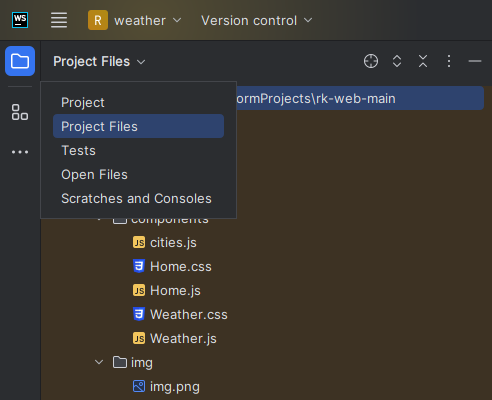
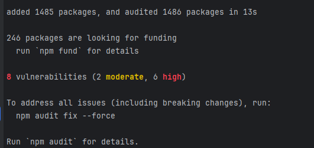

# Проект WeatherMap
Если вы используйете WebStorm то переведите project В project files:



## Установка и Запуск

1. Выполните следующие команды в терминале:

    ```bash
    npm install
    npm start
    ```

   **Примечание:** Игнорируйте ошибку, которая отображена на изображении, так же проект может запускаться долго, но запуститься .

2. Используйте apiKey в проекте. Он может истечь, но не должен.

## Описание проекта

Проект WeatherMap предоставляет актуальные метеорологические данные, полученные из сервиса OpenWeatherMap. Сервис объединяет данные от различных источников, включая метеорологические станции, спутники и пользовательские отчеты.

## Компоненты

### App

Основной компонент, который использует React Router для навигации между страницами.

### Home

Страница, представляющая проект WeatherMap. Отображает информацию о метеорологических данных и создателе проекта.

### Weather

Компонент для отображения текущей погоды в различных городах. Использует API OpenWeatherMap для получения прогнозов.

### Ecology

Страница, рассказывающая о влиянии погодных явлений на экологию и природу. Обсуждает, как изменения в погоде могут повлиять на окружающую среду и как можно способствовать экологической устойчивости.

### Gallery

Страница с фотогалереей, где пользователи могут делиться своими фотографиями, отображая различные погодные условия и отсавляя комментарии.

